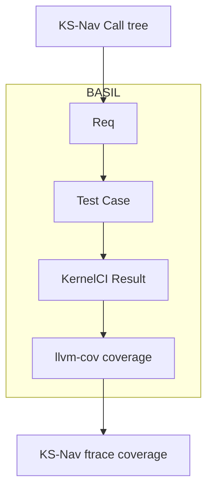

```mermaid
graph TD
    A[KS-Nav Call tree] --> B[Req]
    B --> C[Test Case]
    C --> D[KernelCI Result]
    D --> E[llvm-cov coverage]
    E --> F[KS-Nav ftrace coverage]

    subgraph G[BASIL]
        B
        C
        D
        E
    end
```